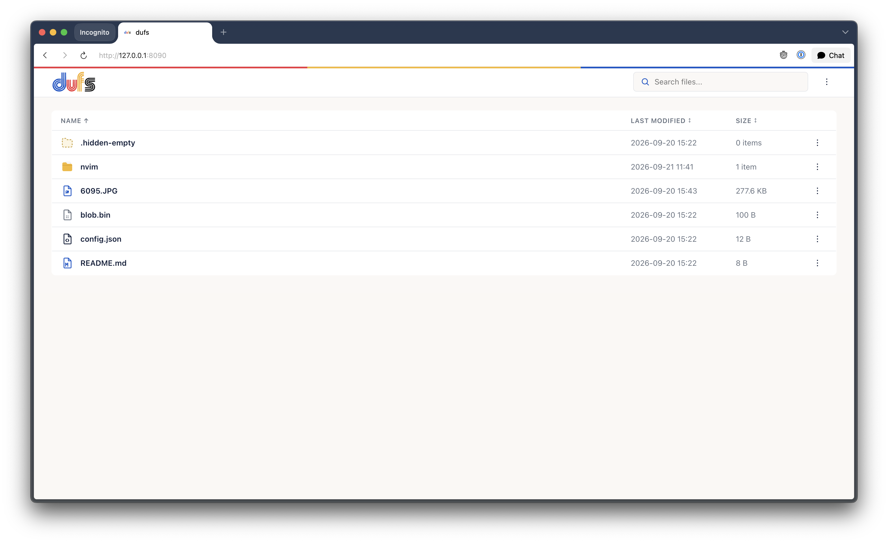

# dufs Bauhaus Web UI

A small third-party Web UI for [dufs](https://github.com/sigoden/dufs).

## Screenshots

| Desktop | Mobile |
|---------|--------|
|  |  |

## Usage

Deploy `dufs`, then start it with this repository as the assets directory:

```sh
dufs --assets /path/to/dufs-bauhaus-web-ui
```
